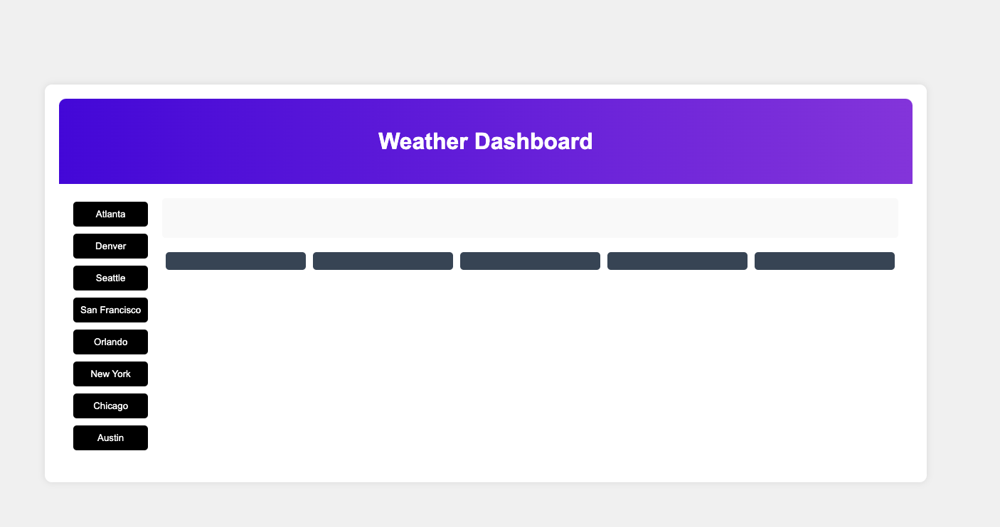

# weather
A weather website using API

  

   ## Description
  A project that tells you the weather for specific cities

  ## License
  This project is licensed under the [MIT](https://opensource.org/licenses/MIT) license.

Table of Contents

* [Initial Setup](#initial-setup)
* [Project Setup](#project-setup)
* [Languages](#languages)
* [Usage](#usage)
* [Contribution](#contribution)
* [Questions](#questions)

# Initial setup

1. To begin working with this project, you need to have several essential tools installed on your system. Follow these steps to install the necessary tools:

2. Install Visual Studio Code
-Visual Studio Code (VS Code) is a powerful code editor that provides many features to aid in development.
-Download and install Visual Studio Code from [here](https://code.visualstudio.com/Download).
-Follow the installation instructions for your operating system.

3. Install Git (if on Windows)
- Git is a version control system that helps track changes in your code and collaborate with others. Download and install Git from [here](https://git-scm.com/downloads).

3. Install Homebrew (if on Mac)
- You can install Homebrew at this [link](https://brew.sh/) 

# Project setup

1. [Clone the project repository](https://docs.github.com/en/repositories/creating-and-managing-repositories/cloning-a-repository)

# Languages
HTML, CSS, JavaScript

# Contribution
Want to improve this project? Great! We encourage contribution to make this project even better. Here are some ways you can contribute:
- Report Bugs: If you find any issues, please report them.
- Suggest feautures: Do you have an idea for a new feature? Share it with us!
- Contribute code: If you have programming skills, feel free to contribute code to the project.
- Provide feedback: Your feedback on the project is valuable. Let us know what you think!

# Questions
## Contact Me

- [Jose'sPortfolio](https://uwttn.github.io/portfolio/)
- [GitHub](https://github.com/uwttn)
- [LinkedIn](https://www.linkedin.com/in/uwttn)
- [Email](muchati@icloud.com)